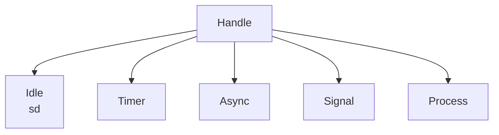
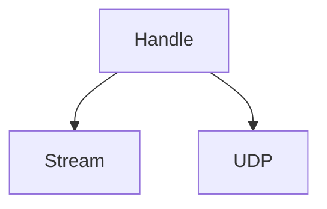

## AAA

### eloop.h

```mermaid
graph TD;

Handle[Handle] --> Idle[Idle\nsd]
Handle --> Timer[Timer]
Handle --> Async[Async]
Handle --> Signal[Signal]
Handle --> Process[Process]

```

### eloop_net.h

```mermaid
graph TD;
Handle --> Stream[Stream]
Handle --> UDP[UDP]

```
